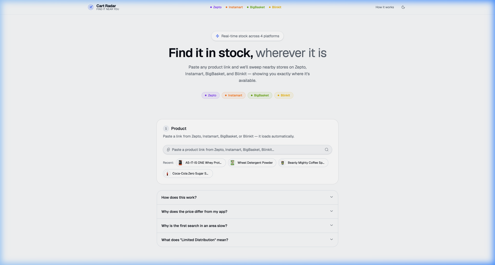
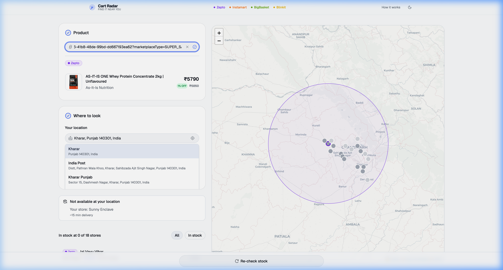
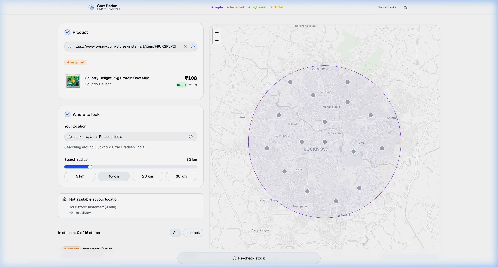
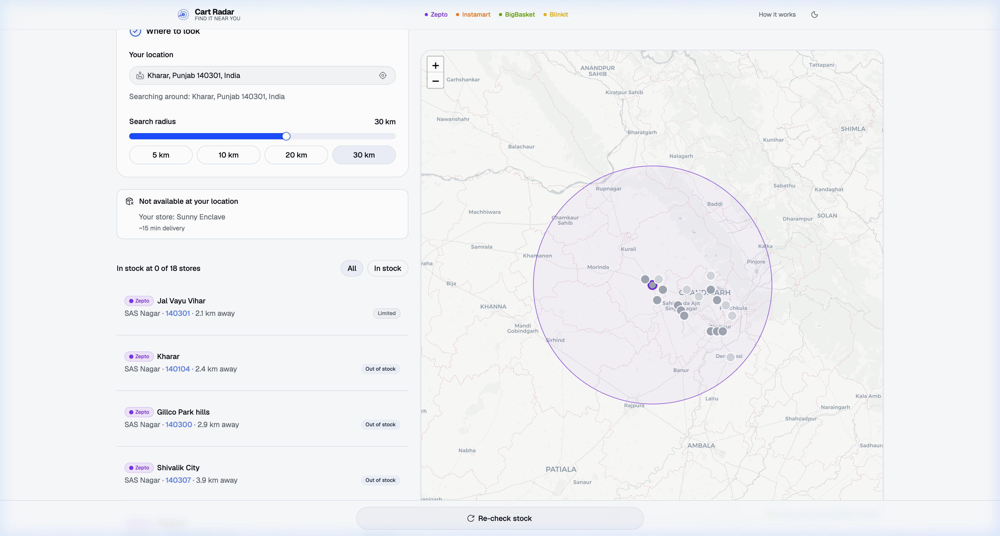

<div align="center">

# 🎯 Cart Radar

**Real-time grocery stock checker across Indian quick-commerce platforms**

[](https://github.com/Harsh-Gopal)
[](https://github.com/Harsh-Gopal/CartRadar)
[](LICENSE)
[](https://python.org)
[](https://react.dev)

*Built and maintained by [@Harsh-Gopal](https://github.com/Harsh-Gopal)*

</div>

> [!NOTE]
> **This project is in active development.** You may occasionally encounter bugs, slow responses, or unavailable platform data — quick-commerce APIs change frequently and some platforms block automated access. If something breaks, wait a moment and try again, or [open an issue](https://github.com/Harsh-Gopal/CartRadar/issues). Contributions and bug reports are welcome!

> [!IMPORTANT]
> **Educational / Personal Project — Legal Disclaimer**
>
> Cart Radar is an independent, **non-commercial, open-source** project created for **educational and personal learning purposes only**.
>
> - It is **not affiliated with, endorsed by, or associated with** Zepto, Swiggy, BigBasket, Blinkit, Tata Neu, or any other platform.
> - It accesses publicly available product and availability data through the same API endpoints that the platforms' own websites use — no credentials, subscriptions, or private access are involved.
> - Using automated tools to access platform APIs may be **against the Terms of Service** of the respective platforms. By running this project, you accept full responsibility for complying with the terms of the platforms you query.
> - This tool is **not intended for commercial use, data scraping at scale, or any activity that harms the platforms**.
>
> If you represent one of these platforms and have concerns, please [open an issue](https://github.com/Harsh-Gopal/CartRadar/issues) or contact directly.

---

## ✨ What is Cart Radar?

Cart Radar is a web app that lets you paste any product link from a supported Indian grocery delivery platform and instantly see **which stores near you** have it in stock — including stores that aren't your default delivery zone.

Instead of just checking your nearest store, Cart Radar performs a **hex-grid sweep** of the surrounding area, probing multiple delivery zones to find every store that has the product.

---

## 📸 Screenshots

<table>
  <tr>
    <td align="center" width="50%">
      <a href="docs/screenshots/home.png" title="Home screen — paste a product link to begin">
        
      </a>
      <br /><sub><b>Home Screen</b> — paste any product link to begin</sub>
    </td>
    <td align="center" width="50%">
      <a href="docs/screenshots/product_resolved.png" title="Product resolved with Zepto store sweep across Chandigarh">
        
      </a>
      <br /><sub><b>Product Resolved</b> — auto-detects platform, sweeps stores on map</sub>
    </td>
  </tr>
  <tr>
    <td align="center" width="50%">
      <a href="docs/screenshots/results_map.png" title="Live search results for an Instamart product in Lucknow">
        
      </a>
      <br /><sub><b>Live Results</b> — store list + map with stock and prices</sub>
    </td>
    <td align="center" width="50%">
      <a href="docs/screenshots/stores_list.png" title="Nearby Zepto stores in SAS Nagar with stock status">
        
      </a>
      <br /><sub><b>Stores List</b> — per-store stock, price, and distance at a glance</sub>
    </td>
  </tr>
</table>

### 🎬 Demo Video

<video src="https://github.com/user-attachments/assets/4c59e5bc-38eb-403c-95b5-1d6b10ada9b0" controls width="100%" style="max-width:900px;border-radius:12px;" title="Cart Radar — demo searching for a product across Zepto, Instamart and BigBasket stores"></video>

> _Can't play the video? View or download it directly from [GitHub](https://github.com/user-attachments/assets/4c59e5bc-38eb-403c-95b5-1d6b10ada9b0)._

---


## 🛒 Supported Platforms

| Platform | Stock Check | Area Sweep | Notes |
|---|---|---|---|
| **Zepto** | ✅ | ✅ | Hex-grid sweep across 5–30 km |
| **Swiggy Instamart** | ✅ | ✅ | Multi-zone sweep |
| **BigBasket** | ✅ | ✅ | Cookie-based location spoofing |
| **Blinkit** | ✅ | ✅ | Playwright-based |
| **BB Now** | ✅ | ❌ | Express delivery only |
| **Tata Neu** | 🚧 | 🚧 | Planned |
| **Amazon Fresh** | 🚧 | 🚧 | Planned |
| **Flipkart Minutes** | 🚧 | 🚧 | Planned |

---

## 🚀 Getting Started

> 📖 **Full step-by-step guide (all OS, troubleshooting):** [`docs/RUNNING.md`](docs/RUNNING.md)

### Prerequisites

| Tool | Install |
|---|---|
| **git** | Pre-installed on most systems |
| **uv** | `brew install uv` / [astral.sh/uv](https://astral.sh/uv) |
| **Node.js 20+ & pnpm** | `brew install node pnpm` / [pnpm.io](https://pnpm.io) |

You don't need to install Python — `uv` handles that.

### Clone

```bash
git clone https://github.com/Harsh-Gopal/CartRadar.git
cd CartRadar/cart-radar
```

### Start everything (one command)

```bash
./dev.sh
```

This starts the **FastAPI backend** (port 8000) and the **Vite dev frontend** (port 5173) together. Press Ctrl+C to stop both.

Open **[http://localhost:5173](http://localhost:5173)** when ready.

<details>
<summary>Manual start (Windows or two separate terminals)</summary>

**Backend:**
```bash
cd backend
uv sync
DEV_MODE=true ENABLED_PLATFORMS=zepto,swiggy,bigbasket,blinkit,bbnow uv run uvicorn app.main:app --port 8000 --reload
```

**Frontend:**
```bash
cd frontend
pnpm install
pnpm dev
```
</details>

---

## 📱 How to Use

1. **Paste a product link** — Copy any product URL from Zepto, Swiggy, BigBasket, Blinkit, or BB Now and paste it in the link box. The app auto-detects the platform instantly.

2. **Set your location** — Type an area name, locality, or pincode — or tap the GPS button to auto-detect. The app remembers your last location.

3. **Set search radius** — Adjust the radius (5–30 km) based on how far you're willing to look. Start with 5–10 km in dense cities.

4. **Check availability** — Hit "Check Availability". Results stream in real time showing which stores have it and at what price.

5. **Get a store address** — **Tap any store row** to open its detail sheet, which shows the precise delivery address. Copy it and temporarily change your delivery address in the platform app to order from that store.

6. **View on map** — Switch to Map view to see all store pins colour-coded by stock status (green = in stock, orange = out of stock).

7. **Watchlist** — While viewing a resolved product, tap the **Bookmark** button to save it to your Watchlist. Access saved products anytime from the Watchlist tab on the home screen — no sign-in required, stored locally in your browser.

---

## 🏗️ Architecture

```
cart-radar/
├── backend/
│   └── app/
│       ├── main.py           # FastAPI entry point, routing, auth
│       ├── search.py         # SSE orchestration, hex-grid sweep
│       ├── store_cache.py    # SQLite cache for discovered stores
│       ├── grid.py           # Haversine distance + hex-grid generator
│       ├── links.py          # URL/product-ID parser (all platforms)
│       ├── ratelimit.py      # Token bucket rate limiter
│       ├── config.py         # Environment-based configuration
│       └── platforms/
│           ├── base.py       # PlatformClient ABC
│           ├── zepto.py      # Zepto client
│           ├── swiggy.py     # Swiggy Instamart client
│           ├── bigbasket.py  # BigBasket client
│           ├── blinkit.py    # Blinkit (Playwright) client
│           └── bbnow.py      # BB Now client
└── frontend/
    └── src/
        ├── App.tsx           # Main application component
        ├── hooks/
        │   └── use-search.ts # SSE event stream hook
        ├── components/       # UI components
        └── lib/
            └── api.ts        # Backend API client
```

### Key Design Decisions

- **SSE Streaming** — Results stream in real-time via Server-Sent Events. Users see stores appear one by one as the sweep progresses, instead of waiting for all results.
- **Hex-Grid Sweep** — Store discovery uses a hexagonally-packed grid to minimize gaps and overlap while covering a circular area efficiently.
- **SQLite Store Cache** — Discovered stores and probed coordinates are cached locally (90-day TTL) to speed up repeat searches.
- **Unified Platform Interface** — All platforms implement the same `PlatformClient` ABC (`resolve_store` + `product_at_store`), making it trivial to add new platforms.
- **Token Bucket Rate Limiting** — Per-IP rate limits with daily caps prevent abuse without requiring authentication.

---

## ⚙️ Configuration

Set these environment variables to configure the backend:

| Variable | Default | Description |
|---|---|---|
| `DEV_MODE` | `false` | Disables auth token requirement |
| `APP_TOKEN` | — | Required auth token (when `DEV_MODE=false`) |
| `MAX_RADIUS_KM` | `50.0` | Maximum search radius |
| `SWEEP_SPACING_KM` | `2.0` | Spacing between hex-grid probe points |
| `MAX_CONCURRENT` | `5` | Max concurrent platform requests |
| `RATE_LIMIT_RPM` | `10` | Max requests per minute per IP |
| `RATE_LIMIT_DAILY` | `200` | Max requests per day per IP |
| `ENABLED_PLATFORMS` | all | Comma-separated list of enabled platforms |
| `DB_PATH` | `stores.sqlite3` | Path to the SQLite store cache |

---

## 🔒 Security

- **No credentials stored** — The app never stores passwords or API keys.
- **HMAC token auth** — Optional auth token uses `hmac.compare_digest` (timing-safe).
- **Input validation** — All API inputs validated via Pydantic models.
- **Rate limiting** — Token bucket per IP + daily caps prevent abuse.
- **XSS safe** — All geocode queries are URL-encoded before passing to Nominatim. All user input is treated as plain text, never rendered as HTML.

---

## 🐛 Known Issues & Roadmap

See [`docs/BUGS.md`](docs/BUGS.md) for the full bug tracker and [`docs/AUDIT_REPORT.md`](docs/AUDIT_REPORT.md) for the comprehensive audit report.

### Critical (Fixed ✅)
- **Geocode 500 error** — `httpx` import was missing in `main.py`, causing HTTP 500 on all Nominatim geocoding fallback paths. Fixed.
- **Zepto WAF bypass** — Zepto blocks automated requests (HTTP 202). Fallback to `SAMPLE_STORE_ID` for product preview. Store sweep still works.

### Planned Improvements
- [ ] Code-split JS bundle (currently 580KB — Leaflet is the main contributor)
- [ ] CORS origins via environment variable (currently hardcoded to localhost)
- [ ] Blinkit native API (replace Playwright for better sweep performance)
- [ ] Tata Neu / Flipkart Minutes / Amazon Fresh integration
- [ ] Automated test suite (pytest for backend, Vitest for frontend)
- [ ] Open Graph / SEO meta tags

---

## 🔮 Future Development

Cart Radar is under active development. Here's what's planned next — contributions welcome!

### Platform Expansion
- **Tata Neu Grocery / BB Now sweep** — Scaffolding in place; needs anti-bot bypass for full geographic sweep
- **Amazon Fresh** — Pincode-based availability check (API reverse-engineering in progress)
- **Flipkart Minutes** — Early-stage research; aggressive WAF

### Performance
- **Code-split JS bundle** — Leaflet and the map panel are lazy-loaded to cut initial load from ~580KB → ~200KB
- **Blinkit native API** — Replace Playwright-based scraping with a native HTTP client for 10× faster sweeps
- **Parallel platform sweep** — Run all platforms simultaneously for a single product link

### Features
- **Price history** — Track price changes over time using the existing SQLite store cache
- **Shareable search links** — Deep-link to a pre-filled search with product + location encoded in the URL
- **Restock alerts** — Push notifications (via Web Push API) when an out-of-stock item becomes available
- **PWA / installable** — Add manifest and service worker for offline support and home-screen install

### Infrastructure
- **CORS via environment variable** — Remove hardcoded localhost origin so any deployment domain works
- **Persistent rate limits** — Move from in-memory to SQLite-backed limits to survive server restarts
- **Docker Compose** — Single `docker compose up` for full-stack local development

### Developer Experience
- **Automated test suite** — pytest for backend platform clients + Vitest for frontend components
- **CI/CD pipeline** — GitHub Actions for lint + test on every PR

---

## 🤝 Contributing

Contributions are welcome! Please:

1. Fork the repo
2. Create a feature branch: `git checkout -b feature/my-feature`
3. Make your changes
4. Run the build: `cd frontend && npm run build`
5. Open a Pull Request

---

## 📄 License

MIT License — see [LICENSE](LICENSE) for details.

---

<div align="center">

Made with ❤️ by [@Harsh-Gopal](https://github.com/Harsh-Gopal) | [GitHub](https://github.com/Harsh-Gopal/CartRadar)

</div>
